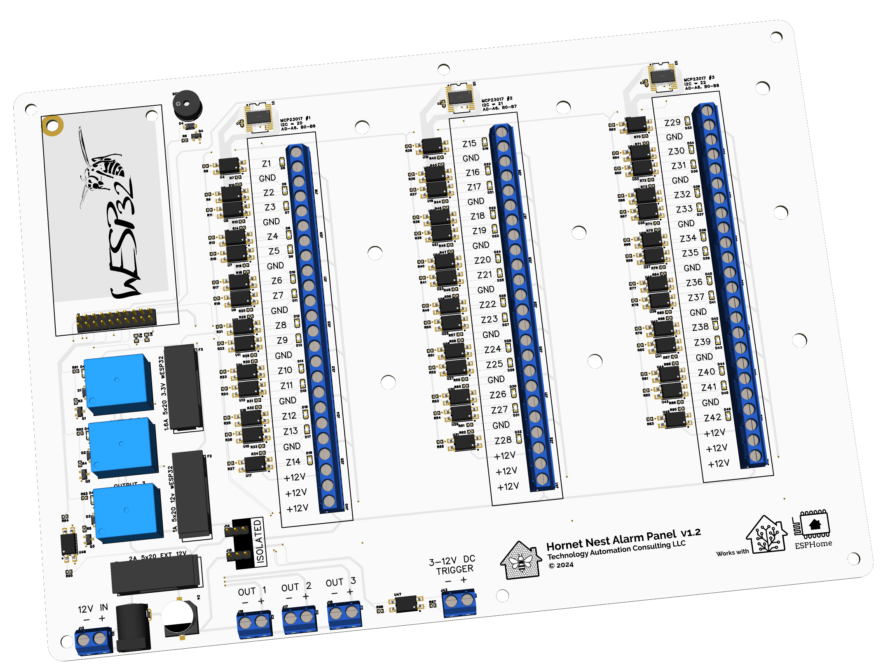
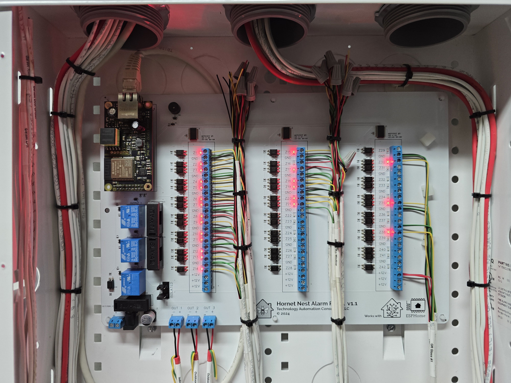
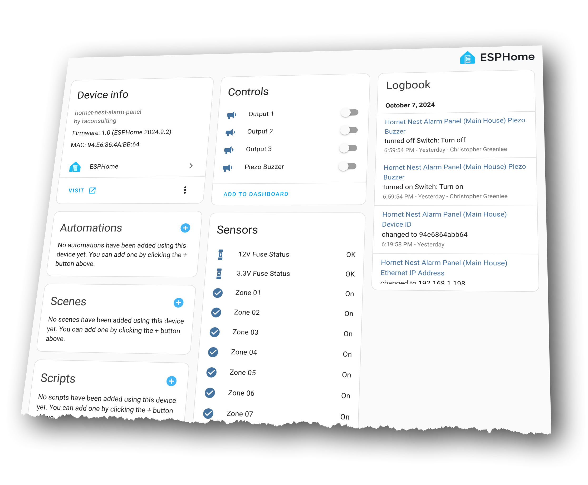

# Hornet Nest Alarm Panel for ESPHome

This repository houses the officially supported **ESPHome** firmware configuration files for the **Hornet Nest Alarm Panel**, developed by **Technology Automation Consulting LLC**. The Hornet Nest Alarm Panel is a scalable and customizable IoT solution designed to integrate traditional wired alarm systems into your smart home using **Home Assistant**. With 42 optoisolated zones, 3 relay outputs, and flexible PoE or 12V power options, it’s built for flexibility and reliability.

  
  

## Quick Start

Get started quickly by adopting and flashing your Hornet Nest Alarm Panel with the latest ESPHome firmware:

1. Plug a PoE powered ethernet cable into the Hornet Nest Alarm Panel.
2. Open the **ESPHome Dashboard** and locate the device "hornet-nest-XXXXXX" (where XXXXXX is a unique hexadecimal identifier).
3. Click on the **Adopt** option on the device.
4. The **Adopt Device** dialog will open.  You can rename your device if desired and then click the **Adopt** option again.
5. The **Configuration Created** dialog will open and indicate that a new configuration needs to be installed on the device, click the **Install** button.
6. ESPHome will begin to compile the new firmware. When the line **"INFO Sucessfully uploaded program."** is diplayed, click **STOP** to close the window.
4. Discover the Hornet Nest Alarm Panel in **Home Assistant** > **Settings** > **Devices & Services**.
5. Click **Configure** on the new device to add it into Home Assistant.

## Changes and Release Notes

See **Releases** for release notes and downloadable pre-built firmware images.

## Made for ESPHome

The **Hornet Nest Alarm Panel** uses the **wESP32 PoE** microcontroller and is fully compatible with **ESPHome** firmware. It is an open-source product, designed for easy user customization, making it ideal for Home Assistant users who need a scalable and flexible alarm solution. The included **ESPHome YAML configuration files** are fully documented, allowing advanced users to easily customize, build, and update their device with a few simple modifications.

## Works with Home Assistant

These **ESPHome** firmware configurations allow for a simple, plug-and-play setup within **Home Assistant**. The integration is local, fast, and fully customizable, giving users complete control over their home security system.

## In This Repository

This repository contains **complete firmware configuration YAML templates** for the **Hornet Nest Alarm Panel** at the top level. These templates are ready to be imported using **ESPHome Dashboard**, where they can be customized and deployed.

## User Manual

For detailed instructions, please refer to the official user manual [here.](hnap-user-manual.pdf)